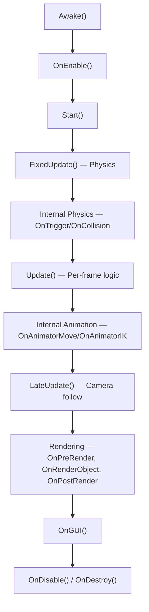
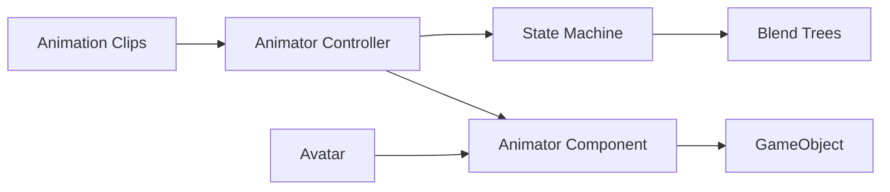

# Unity Game Dev Field Guide — Knowledge Base

> Combined from the **Unity Game Dev Field Guide** (79-page PDF) + **Official Unity Documentation**
> Source: [Unity Manual](https://docs.unity3d.com/Manual/index.html)

---

## 1. 🏗️ Core Architecture

- **Component-Based Model** — GameObjects are containers; all behavior comes from **Components** (Transform, Renderer, Collider, scripts)
- **Use LTS versions** for production — bi-weekly patches, 2-year support window
- **Force Text serialization** (`Project Settings > Editor`) — makes `.scene`/`.prefab`/`.asset` human-readable for Git diffs/merges

---

## 2. 📁 Project Organization & Version Control

### Standard Folder Structure
```
Assets/
├── Animations/     ├── Prefabs/
├── Materials/      ├── Scripts/
├── Scenes/         └── Textures/
```

### Git Rules
| **Commit** | **Ignore (.gitignore)** |
|---|---|
| `Assets/`, `Packages/`, `ProjectSettings/` | `Library/`, `Logs/`, `UserSettings/`, `Temp/` |

- Enable **Visible Meta Files** in `Project Settings > Editor`

### Scene Hierarchy Tips
- Use **named empty GameObjects** as separators (`--- ENVIRONMENT ---`, `--- UI ---`)
- World floor at **y=0**, maintenance objects at **(0,0,0)**
- **Separate static vs dynamic** for batching/lighting optimization

---

## 3. 🧩 Prefab Workflows

| Technique | Use Case |
|---|---|
| **Prefab Mode** | Edit in isolation (double-click) — avoids scene pollution |
| **Nested Prefabs** | Compose objects (Wheel → Car) |
| **Prefab Variants** | Inheritance — base `Enemy` → `FastEnemy` / `StrongEnemy`, overrides stay synced |

> [!TIP]
> If you place something more than once, it should be a Prefab.

---

## 4. 💻 MonoBehaviour Lifecycle (Official Docs)

### Full Execution Order


### Advanced Lifecycle Hooks
| Callback | When |
|---|---|
| `[InitializeOnLoad]` | Runs on Editor launch (static constructor) |
| `[RuntimeInitializeOnLoadMethod]` | Runs at runtime init before scene load |
| `OnAnimatorMove` | Override root motion during animation |
| `OnAnimatorIK` | Set IK positions/weights during animation |
| `SceneManager.sceneLoaded` | After `OnEnable` but before `Start` for all scene objects |

### Script Execution Order
- You **cannot** guarantee order between instances of the same script
- Use `Edit > Project Settings > Script Execution Order` to set priority between different scripts

---

## 5. ⏱️ Coroutines & Async

### Coroutines
- Return `IEnumerator`, suspend at `yield return`
- Start with `StartCoroutine()`, stop with `StopCoroutine()`
- **Auto-stop** when: GameObject deactivated, or MonoBehaviour `Destroy()`'d
- ⚠️ **Disabling** the script (`enabled = false`) does **NOT** stop coroutines

| Yield Instruction | Resumes When |
|---|---|
| `yield return null` | Next frame (after `Update`) |
| `yield return new WaitForSeconds(t)` | After `t` seconds |
| `yield return new WaitForFixedUpdate()` | After next `FixedUpdate` |
| `yield return new WaitForEndOfFrame()` | End of frame (after rendering) |
| `yield return new WaitUntil(() => cond)` | When condition becomes true |

### Modern Async (Unity 2023+)
- `Awaitable` class — Unity's custom async/await with resume-point control
- .NET `Task` resumes during `Update` phase
- Order between coroutines and awaitables is **not guaranteed**

---

## 6. 📦 ScriptableObjects

**What:** Data containers that exist as project **assets** (not attached to GameObjects)

**Key Use Cases:**
- **Shared runtime data** — one copy in memory, referenced by many prefabs (avoids data duplication)
- **Configuration assets** — game settings, item databases, ability definitions
- **Editor tools** — `EditorTool` and `EditorWindow` derive from ScriptableObject

```csharp
[CreateAssetMenu(fileName = "NewData", menuName = "Game/DataAsset")]
public class GameData : ScriptableObject
{
    public int maxHealth;
    public float moveSpeed;
}
```

---

## 7. 🎮 2D Physics

### Core Components
| Component | Purpose |
|---|---|
| **Rigidbody2D** | Enables physics simulation (gravity, forces, velocity) |
| **Collider2D** | Collision detection (BoxCollider2D, CircleCollider2D, PolygonCollider2D, etc.) |
| **Effector2D** | Apply forces in areas (BuoyancyEffector2D, SurfaceEffector2D, PlatformEffector2D) |
| **2D Joints** | Connect Rigidbodies (HingeJoint2D, SpringJoint2D, DistanceJoint2D, etc.) |
| **Physics Material 2D** | Control friction and bounciness on colliders |

> [!IMPORTANT]
> All physics calculations go in `FixedUpdate()`, never in `Update()`.

---

## 8. 🎬 Animation System (Mecanim)

### Architecture


### Key Concepts
- **Animation Clips** — Recordings of property changes over time
- **Animator Controller** — State machine that manages clip playback + transitions
- **Blend Trees** — Interpolate multiple clips for smooth motion (walk → run)
- **Avatar** — Humanoid skeleton mapping for retargeting between characters
- **StateMachineBehaviour** — Script callbacks: `OnStateEnter`, `OnStateUpdate`, `OnStateExit`, `OnStateMove`, `OnStateIK`

---

## 9. ⚡ Performance & Memory (Official Best Practices)

### The Golden Rules
| Rule | Why |
|---|---|
| Cache `GetComponent`/`Find` in `Awake` | Heap allocations + search cost each frame |
| **Never `new` in `Update`** | Triggers GC → frame stutters |
| Multiply movement by `Time.deltaTime` | Framerate independence |
| Use `FixedUpdate` for physics | Constant timestep matters |
| Use `LateUpdate` for cameras | Target has already moved |

### Object Pooling (`UnityEngine.Pool`)
```csharp
// Unity's built-in pooling API
ObjectPool<GameObject> pool = new ObjectPool<GameObject>(
    createFunc: () => Instantiate(prefab),
    actionOnGet: obj => obj.SetActive(true),
    actionOnRelease: obj => obj.SetActive(false),
    actionOnDestroy: obj => Destroy(obj),
    maxSize: 20
);
```

### Advanced Optimization
| Technique | When |
|---|---|
| **Job System** | CPU-bound work → multi-threaded, burst-compiled |
| **async/await + Awaitable** | Spread work across frames without coroutine overhead |
| **`UnityEngine.Pool`** | Built-in pooling API (bullets, particles, enemies) |
| **`StringBuilder`** | String building in loops instead of `+` concatenation |
| **Avoid LINQ in hot paths** | Creates temporary enumerator allocations |
| **`TransformHandle`** | Batch unmanaged transform operations |

### Profiling Tools
| Tool | Purpose |
|---|---|
| **Unity Profiler** | CPU/GPU bottlenecks, memory leaks, GC spikes |
| **Frame Debugger** | Step through draw calls, inspect batching |
| **Physics 2D Profiler** | 2D-specific physics performance |

---

## 10. 🎨 Graphics & Render Pipelines

| Pipeline | Use Case |
|---|---|
| **URP** (Universal) | Cross-platform, mobile-optimized |
| **HDRP** (High Definition) | High-end PC/Console |

### Rendering Callbacks (Built-in Pipeline)
`OnPreCull` → `OnBecameVisible` → `OnWillRenderObject` → `OnPreRender` → `OnRenderObject` → `OnPostRender` → `OnRenderImage`

### Visual Authoring
- **Shader Graph** — Node-based shader creation
- **VFX Graph** — GPU-accelerated particle systems

---

## 11. 🛠️ Essential Tools

| Tool | What It Does |
|---|---|
| **Cinemachine** | Procedural cameras — follow, blend, shake |
| **ProBuilder** | 3D modeling & grayboxing in-editor |
| **Odin Inspector** | Powerful custom inspector UI (3rd party) |

---

## 12. 🎯 Quick-Reference Cheat Sheet

### ✅ Do
- Force Text serialization + Visible Meta Files for Git
- Use LTS Unity for production
- Cache expensive calls in `Awake`/`Start`  
- Use `ObjectPool<T>` for spawned objects
- Organize hierarchy with separator GameObjects
- Use Prefab Variants for inheritance
- Use ScriptableObjects for shared data
- Profile with Unity Profiler **before** optimizing

### ❌ Don't
- `GetComponent` / `Find` inside `Update`
- `new` allocations inside `Update`
- LINQ in performance-critical loops
- String `+` concatenation in hot paths
- Physics logic in `Update` — use `FixedUpdate`
- Assume coroutine order between scripts
- Optimize without measuring first
